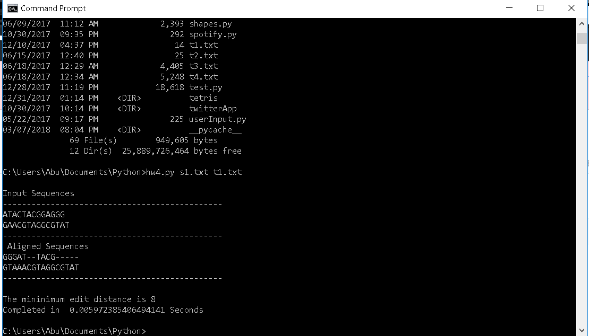

# LevenshteinDistance

This program accepts two strings on the command line (filenames) and reads the strings. The program then performs the Wagner-Fischer computation and then prints out the edit distance & the completion time for the algorithm.

Example output is below.

s1 & t1/ s2 & t2 / s4 & t4 are all trivial sequences. S3 and T3 represents the NRAS genomic sequence in humans and in cows (which are involved in some cancers)
